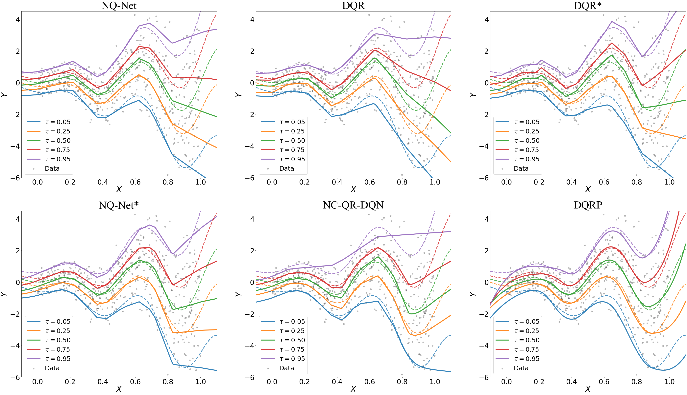

# Deep Distributional Learning with Non-crossing Quantile Network

This repository contains the implementation for the paper "Deep Distributional Learning with Non-crossing Quantile Network" (NQ-Net) as well as the paper "Non-Crossing Quantile Regression for Distributional Reinforcement Learning" (NC-QRDQN)[[1]](#references) in Python.

The code contains two versions. For fare comparison, the main branch is build on top of [[2]](#references) which use OpenAI gym as the environment. Since Gym is no longer maintained by OpenAI, it has complicated installing process and dependance issues. The results and figures in our paper is generated by this branch. 

To foster future research in distributional reinforcement learning, we developed an updated version using OpenAI gymnasium and Stable-baseline3. The updated version is in the branch `Gymnasium`. The installation process is more elegant and stable.

## Installation
### Main branch

1. First clone the repository and install the dependencies:
```bash
conda create -n distRL python=3.6.13 -y
conda activate distRL
```
2. Follow the instructions in [[4]](#references) to install `atari-py` as well as the atari games. 
```bash
pip install atari-py
python -m atari_py.import_roms ROMS
```

3. Install the dependencies:
```bash
pip install -r requirements.txt --verbose
```
NOTE: The install of opencv-python make take a while, the --verbose flag is used to show the progress. If you are using A100 GPU, run the code below: 
```bash
pip3 install torch==1.9.1+cu111 torchvision==0.10.1+cu111 torchaudio==0.9.1 -f https://download.pytorch.org/whl/torch_stable.html
```

### Gymnasium branch
TBD

## Reproducing the results
1. Figure 4: Entering `simulation` folder and run the following command:
```bash
python presentation.py --model wave
```
The figure will be saved in `simulation/figure` folder, you can change the model to run for `triangle` and `linear` as well.


2. Figure 5: Entering the directory of the repository and run the following command for all the environments:
```bash
python train.py --cuda --model ncQRDQN --env_id TennisNoFrameskip-v4 --seed 0 &
python train.py --cuda --model ncQRDQN --env_id TennisNoFrameskip-v4 --seed 1 &
python train.py --cuda --model ncQRDQN --env_id TennisNoFrameskip-v4 --seed 2 &
python train.py --cuda --model DEnet --env_id StarGunnerNoFrameskip-v4 --seed 0 &
python train.py --cuda --model DEnet --env_id StarGunnerNoFrameskip-v4 --seed 1 &
python train.py --cuda --model DEnet --env_id StarGunnerNoFrameskip-v4 --seed 2 &
```
NOTE: The training process may take 5-10 days to finish all the 200M frames. This is due to interaction between agents and Atari games and the bottleneck is most likely to be CPU. To speed up the process, you may consider rewrite the code with [[5]](#references) to use multiple environments.
The results(testing/training reward and model checkpoints) will be saved in `logs` folder. After the training process is finished, you can run the following command to generate the figure:
```bash
python plot.py
```
NOTE: you need to entering `plot.py` and change the envs on line 10 to the environments you want to plot.


## References
[[1]](https://proceedings.neurips.cc/paper_files/paper/2020/file/b6f8dc086b2d60c5856e4ff517060392-Paper.pdf) Zhou, Wang, et al. "Non-crossing quantile regression for distributional reinforcement learning." Advances in neural information processing systems. 2020.

[[2]]( https://github.com/toshikwa/fqf-iqn-qrdqn.pytorch) FQF, IQN and QR-DQN in PyTorch -github repository

[[3]]( https://github.com/openai/gym) OpenAI gym - github repository

[[4]](https://github.com/openai/atari-py?tab=readme-ov-file) atari-py - github repository

[[5]](https://stable-baselines3.readthedocs.io/en/master/guide/vec_envs.html) Stable-baselines3 Vectorized Environments


## Citation
Please cite our paper if you use this code in your own work.

